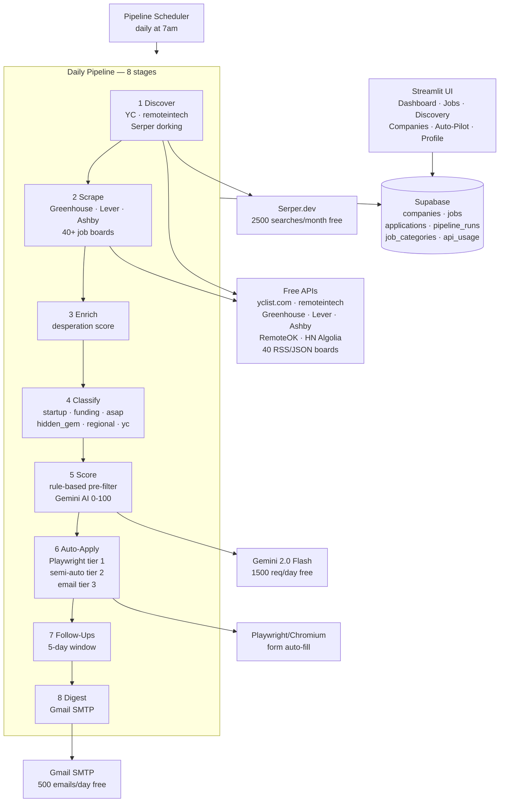

# Job Scout V2

> Autonomous job search tool — discovers, scores, and applies to remote software-engineering jobs daily. Built and used daily by [@sakshi-suryawanshi](https://github.com/sakshi-suryawanshi) to apply to 1000 jobs in 10 days using entirely free APIs.

[](https://github.com/sakshi-suryawanshi/job-scout/actions/workflows/ci.yml)
[](https://www.python.org/)
[](#free-tier-limits)

---

## The Problem

Applying to 1000 remote software engineering jobs manually is a full-time job in itself. You spend more time copy-pasting than you do tailoring your application. You miss hidden gems on small boards nobody else checks. You forget follow-ups.

Job Scout solves this with a daily automated pipeline:

```
Discover new companies → Scrape 40+ boards → Score with AI → Auto-apply → Email digest
```

Everything runs on **free APIs**. Zero paid services. No subscription.

---

## What it does

| Feature | Details |
|---|---|
| **40+ job boards** | RemoteOK, Remotive, HN Who's Hiring, Jobicy, Cord, Wellfound, Himalayas, and 35 more |
| **ATS scraping** | Direct API: Greenhouse, Lever, Ashby (100+ companies each) |
| **Google dorking** | Serper.dev — discovers hidden startups via LinkedIn, Indeed, distress signals |
| **AI scoring** | Gemini 2.0 Flash — rates 0-100 against your criteria. Rule-based pre-filter saves quota. |
| **Resume tailoring** | Gemini rewrites your resume for each job. Download as .txt or .html → PDF. |
| **Desperation scoring** | Flags companies that are urgently hiring — they respond faster. |
| **Auto-apply tier 1** | Playwright form-fill for Greenhouse / Lever / Ashby (headless Chromium) |
| **Auto-apply tier 2** | Pre-fills form values for Workday / custom forms — user clicks Submit in ~20s |
| **Auto-apply tier 3** | Cold email outreach for HN / Reddit posts with no ATS form |
| **Daily digest** | HTML email: what was found, what was applied, what needs follow-up |
| **Scheduled** | Runs every morning at 7am. Configurable via UI. |

---

## Architecture



---

## Tech stack

| Layer | Technology | Why |
|---|---|---|
| **UI** | Streamlit | Rapid iteration. Free Community Cloud deploy. |
| **Database** | Supabase (PostgREST) | Free 500MB. No ORM needed — direct REST calls keep it portable. |
| **AI scoring** | Gemini 2.0 Flash | Free 1500 req/day via Google AI Studio. Rule-based pre-filter keeps usage low. |
| **Discovery** | Serper.dev | Only service used for LinkedIn/Indeed dorking. 2500/month free. |
| **Auto-apply** | Playwright | Only free option for automating ATS form submission. |
| **Scheduling** | Python `schedule` + Docker | No external scheduler needed. Two containers: UI + pipeline. |
| **Email** | Gmail SMTP | Free 500/day. App password — no OAuth needed. |

---

## Free tier limits

| Service | Free limit | How Job Scout stays under |
|---|---|---|
| Gemini 2.0 Flash | 1,500 req/day | Rule-based pre-filter skips ~60% of candidates before AI |
| Serper.dev | 2,500/month | 78 queries/day budget. Daily cooldowns per category. |
| Supabase | 500MB DB | Jobs + companies + applications ≈ 50MB. |
| Gmail SMTP | 500/day | Hard cap at 50 outreach emails/day in code. |

---

## Quick start

### Prerequisites
- Python 3.11+
- Docker + Docker Compose (for auto-apply)
- A [Supabase](https://supabase.com) free project
- A [Google AI Studio](https://aistudio.google.com/app/apikey) API key (Gemini)
- A [Serper.dev](https://serper.dev) API key

### 1. Clone and set up
```bash
git clone https://github.com/sakshi-suryawanshi/job-scout
cd job-scout
cp .env.example .env
# Edit .env with your keys
```

### 2. Set up the database
```bash
# Apply all migrations via the Supabase SQL editor, or use the MCP integration:
python scripts/migrate.py
```

### 3. Run locally
```bash
pip install -r requirements.txt
streamlit run app/main.py
```
Open http://localhost:8501 → Profile → paste your resume → Settings → save board config.

### 4. Run the pipeline once
```bash
python -m job_scout.pipeline.scheduler --now
```

### 5. Run with Docker (auto-apply + scheduler)
```bash
# Also installs Playwright/Chromium for auto-apply
docker compose up -d
docker compose logs -f pipeline  # watch the daily scheduler
```

---

## Configuration

All configuration is via `.env` (copy `.env.example`):

| Variable | Required | Description |
|---|---|---|
| `SUPABASE_URL` | ✅ | Your Supabase project URL |
| `SUPABASE_KEY` | ✅ | Supabase anon key |
| `GEMINI_API_KEY` | Scoring/tailoring | Google AI Studio key |
| `SERPER_API_KEY` | Discovery | Serper.dev key |
| `GMAIL_USER` | Email digest | Your Gmail address |
| `GMAIL_APP_PASS` | Email digest | 16-char Gmail app password |
| `DIGEST_EMAIL` | Email digest | Where to send the daily digest |
| `APPLY_EMAIL` | Auto-apply | Your application email |
| `APPLY_FIRST_NAME` | Auto-apply | |
| `APPLY_LAST_NAME` | Auto-apply | |
| `APPLY_PHONE` | Auto-apply (optional) | |
| `APPLY_LINKEDIN` | Auto-apply (optional) | |
| `APPLY_GITHUB` | Auto-apply (optional) | |
| `DEMO_MODE` | Demo only | Set `true` to use mock data without real API keys |

---

## Design decisions

**Why PostgREST directly instead of an ORM?**
Supabase's Python SDK wraps PostgREST but adds a proxy layer that was causing intermittent 406 errors. Direct `httpx` calls to the PostgREST endpoint are more reliable and have zero overhead. The tradeoff is more verbose query building — acceptable for this scale.

**Why rule-based pre-filter before Gemini?**
Gemini's free tier is 1500 req/day. With 40+ boards scraping 100+ jobs each, sending everything to Gemini would exhaust the quota in minutes. A fast regex-based scorer runs first and skips jobs scoring below 15/100 — this eliminates ~60% of candidates before any AI call, leaving Gemini for jobs that actually matter.

**Why Playwright instead of a form API?**
ATS platforms (Greenhouse, Lever, Ashby) don't expose public form submission APIs — by design. Playwright is the only free way to automate form submission at scale without violating terms of service (it mimics a real browser). The ~80% success rate on standard forms is high enough to justify it; failures fall through to tier 2 (semi-manual, ~20 seconds each).

**Why per-category cooldowns for Serper?**
Running the same Google dorks daily returns the same results. A 7-day cooldown on most categories (1-day for `linkedin_daily`/`indeed_daily`) ensures each query finds genuinely new companies. This stretches 2500 queries/month to cover 13 discovery categories with headroom for manual queries.

**Why single-user now, multi-user schema?**
Every table has a `user_id` FK even though there's currently one user. Adding multi-user support later is a one-day migration + auth layer addition. Without it baked in from the start, it would require touching every query.

---

## Project structure

```
job_scout/
├── app/                    Streamlit UI
│   ├── main.py
│   └── pages/
│       ├── 00_dashboard.py
│       ├── 10_jobs.py
│       ├── 20_companies.py
│       ├── 30_discovery.py
│       ├── 40_pipeline.py
│       ├── 50_profile.py
│       └── 90_settings.py
├── job_scout/              Core domain package (V2)
│   ├── ai/gemini.py        Gemini client + scoring + tailoring
│   ├── application/        Auto-apply: Playwright + semi-auto + email
│   ├── db/                 DB client + repositories + migrations
│   ├── discovery/          Company discovery: YC, remoteintech, Serper, HN
│   ├── enrichment/         Dedup, filters, desperation scoring, classifier
│   ├── notifications/      Gmail SMTP email sender
│   ├── pipeline/           8-stage daily pipeline + scheduler + digest
│   └── scraping/           ATS scrapers + 40 job board scrapers
├── worker/                 V1 modules (now re-export stubs → job_scout/)
├── tests/                  Unit tests
├── scripts/                CLI helpers
├── docker/                 Pipeline Dockerfile
└── docker-compose.yml
```

---

## License

MIT — see [LICENSE](LICENSE).
